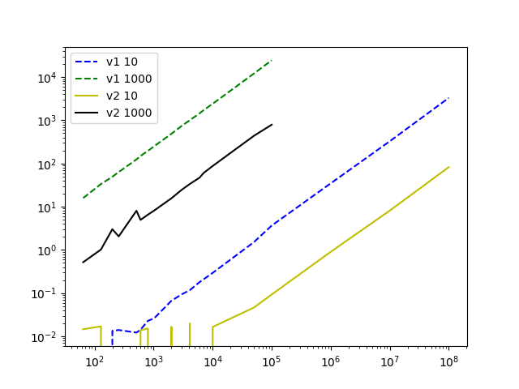
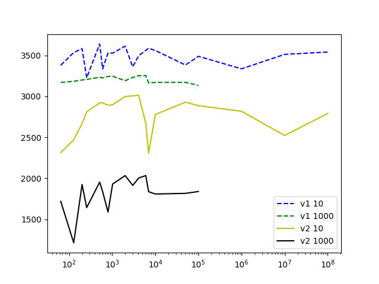

# EP 03 — Otimização de Ajuste de Curvas

**Nome:** Juliana Zambon  
**GRR:** 20224168  
**Login DINF:** jz22

**Disciplina:** Introdução à Computação Científica – CI1164  
**Departamento:** Departamento de Informática  
**Universidade:** Universidade Federal do Paraná (UFPR)

## Introdução 

Este trabalho, referente ao EP 03 da disciplina de Introdução à Computação Científica (CI1164), tem como objetivo principal otimizar o desempenho do programa `ajustePol`. Este programa realiza o ajuste de uma curva polinomial de grau N a partir de K pontos, utilizando o Método dos Mínimos Quadrados para a geração do Sistema Linear (SL) e o Método da Eliminação de Gauss com pivoteamento parcial para sua solução.

O EP03 consistiu em duas etapas principais: a implementação de otimizações no código original `ajustePol_v1.c` para criar uma versão aprimorada `ajustePol_v2.c`, e uma análise comparativa do desempenho de ambas as versões, utilizando a ferramenta LIKWID para coletar métricas de tempo, cache, energia e operações aritméticas.

---

## Estrutura de diretórios

```c
.
├── ajustePol_v1.c
├── ajustePol_v2.c
├── data
├── gera_entrada.c
├── LEIAME.md
├── Makefile
├── scripts
│   ├── graficos.py
│   ├── saidas_likwid.py
│   └── testes.sh
├── utils.c
└── utils.h
```

## Melhoria de Desempenho

Para obter a versão otimizada `ajustePol_v2.c` a partir do código original `ajustePol_v1.c`, foram **testadas** as seguintes alterações:

1.  **Alteração NÃO realizada:** Na versão original otimizada (v2), o cálculo das potências de `x[k]` (usadas na construção do sistema linear) era feito previamente, com armazenamento em uma matriz `x_powers[k][2n-1]`. Essa abordagem visava eliminar chamadas repetidas à função `pow()` e melhorar o desempenho via acesso contíguo à memória.
Na nova versão, essa matriz foi removida. Em vez disso, as potências de `x[k]` são calculadas de forma local, no momento em que são necessárias, utilizando um vetor temporário de tamanho fixo `(x_pow[2n-1])` dentro do loop de montagem do sistema.

    **Justificativa:** A versão anterior, embora eficiente em termos de tempo para tamanhos de entrada pequenos e médios, apresentava uso de memória proporcional a `K * (2n-1)`. Com valores grandes de K (por exemplo, K = 10⁸), o consumo ultrapassava facilmente 16 GB de RAM, levando a falhas por falta de memória (segfaults), mesmo em máquinas com especificações razoáveis.
    A nova abordagem mantém a eficiência ao: Evitar chamadas caras a `pow()` usando multiplicações iterativas; Reduzir o uso de memória para um valor constante, independente de K; Melhorar a localidade de cache, já que `x_pow` permanece na memória rápida (L1/L2); Permitir que o programa escale para valores de K muito grandes sem travar o sistema ou causar falhas de alocação.
    Embora essa mudança traga uma pequena perda de desempenho para valores pequenos de K, ela é negligenciável para N pequeno (como N = 10), e é completamente compensada pela viabilidade de execução em larga escala, principal foco deste trabalho. Nos testes realizados, a nova abordagem: Eliminou os erros de segmentação para K grandes (10⁷, 10⁸);


Para obter a versão otimizada `ajustePol_v2.c` a partir do código original `ajustePol_v1.c`, foram **implementadas** as seguintes alterações:

1.  **Redução de Uso de Memória e Otimização da Geração de Potências (Função `montaSL`)**
    * **Problema Original:** A versão original poderia alocar uma matriz `x_powers[K][2n-1]` para armazenar todas as potências de `x` para cada ponto. Para `K` muito grande (e.g., $10^8$), isso causaria um estouro de memória (`Out Of Memory`).
    * **Otimização:** Em `v2`, a matriz `x_powers` foi substituída por um vetor temporário `x_pow` de tamanho fixo (`max_power = 2 * n - 1`). Este vetor é alocado uma única vez e suas potências são calculadas **localmente para cada ponto** $x[k]$ (`x_pow[i] = x_pow[i-1] * x[k]`).
    * **Benefício:** Esta alteração permite que o programa rode com `K` muito grande (até $10^8$ ou mais) sem estourar a memória. Além disso, o cálculo iterativo `x_pow[i] = x_pow[i-1] * x[k]` é significativamente mais rápido do que chamadas repetitivas à função `pow()` da biblioteca matemática, que é mais genérica e computacionalmente mais cara. Isso impacta diretamente o tempo e a energia na fase de **geração do SL (A)**.

2.  **Reuso de Vetor Temporário para Potências (Função `montaSL`)**
    * **Problema Original:** Se houvesse cálculo de potências dentro do loop mais interno, poderia haver recalculos ou má utilização de cache.
    * **Otimização:** O vetor `x_pow` é explicitamente alocado e reutilizado para cada ponto `k`. As potências de `x[k]` são calculadas uma única vez para aquele `k` e então reutilizadas nos loops internos para preencher `A` e `b`.
    * **Benefício:** Reduz o custo computacional e o número de acessos à memória, melhorando a localidade temporal e espacial. Contribui para a eficiência na **geração do SL (A)**.

3.  **Troca de Linhas por Ponteiros (Função `eliminacaoGauss`)**
    * **Problema Original:** Em implementações ingênuas do pivoteamento parcial na Eliminação de Gauss, a troca de linhas pode envolver a cópia de grandes blocos de memória (elementos de toda a linha da matriz `A` e do vetor `b`).
    * **Otimização:** A `v2` implementa a troca de linhas da matriz `A` através da **troca de ponteiros** para as linhas. Em vez de copiar os dados, apenas os endereços de memória das linhas são trocados.
    * **Benefício:** Evita operações de cópia de memória dispendiosas, que são intensivas em tempo e largura de banda da memória, especialmente para matrizes grandes ($N=1000$). Isso melhora o desempenho na fase de **solução do SL (B)**.

4.  **Loop Unrolling na Retro-substituição (Função `retrossubs`)**
    * **Problema Original:** Loops com poucas operações por iteração podem ser ineficientes devido ao overhead de controle de laço e à subutilização das unidades de execução do processador.
    * **Otimização:** A retro-substituição foi otimizada com a técnica de *loop unrolling* com um fator de `UNROLL_FATOR = 4`. Isso significa que, dentro do loop, 4 iterações consecutivas são processadas de uma vez antes que a condição do loop seja verificada. Um loop final (`for (; j < n; j++)`) lida com os elementos restantes que não formam um grupo completo de `UNROLL_FATOR`.
    * **Benefício:** Reduz o número de verificações de condição de laço e saltos, permite que o compilador realize agendamento de instruções mais eficaz (especialmente com `-O3`), e potencialmente aproveita melhor o paralelismo em nível de instrução (ILP) e as unidades de execução do processador (como as unidades AVX/SIMD se as operações forem vetorizáveis). Contribui para a eficiência na fase de **solução do SL (B)**, especialmente para $N=1000$.

5.  **Cálculo Iterativo de $f(x)$ na Função `P()`**
    * **Problema Original:** A função `P()` (cálculo do valor do polinômio $f(x_i)$ para os resíduos) poderia usar a função `pow()` repetidamente para calcular $x^i$.
    * **Otimização:** Em vez de `pow(x_val, i)`, o cálculo de $x^i$ é feito de forma iterativa (`x_power *= x_val`).
    * **Benefício:** Elimina as chamadas de função `pow()`, que são operações genéricas e mais lentas, substituindo-as por multiplicações simples. Isso acelera o cálculo dos resíduos, que, embora não seja a parte principal do tempo de execução, contribui para a performance geral ao final do programa.

6.  **Uso de `calloc` para Inicialização de Memória**
    * **Problema Original:** `malloc` aloca memória sem inicializá-la, podendo conter "lixo" de operações anteriores.
    * **Otimização:** As alocações dos vetores `x`, `y`, `b` e `alpha` agora utilizam `calloc` em vez de `malloc`.
    * **Benefício:** `calloc` aloca a memória e a inicializa automaticamente com zeros. Isso garante que as estruturas de dados estejam limpas antes do uso, o que pode melhorar a estabilidade numérica e evitar comportamentos inesperados em certas situações, embora o impacto direto no desempenho em tempo de execução para os casos testados possa ser marginal se os dados fossem sobrescritos de qualquer forma.

7.  **Alocação Contígua da Matriz `A`**
    * **Problema Original:** A alocação de `double **A` seguida de `malloc` para cada linha individualmente resulta em linhas espalhadas na memória.
    * **Otimização:** A matriz `A` é alocada de forma contígua em um único bloco de memória (`A_data`). Em seguida, os ponteiros em `A` são configurados para apontar para as posições corretas dentro desse bloco contíguo.
    * **Benefício:** Melhora significativamente a **localidade de cache** (acessos sequenciais a elementos da matriz tendem a estar em blocos de cache adjacentes) e reduz o número de falhas de TLB (Translation Lookaside Buffer). Isso é crucial para o desempenho de algoritmos que varrem grandes matrizes como a Eliminação de Gauss e a geração do SL, levando a menos *cache misses* e acessos mais rápidos à memória. Afeta ambas as fases do programa, **geração do SL (A)** e **solução do SL (B)**.


## Análise de Desempenho

A análise de desempenho foi realizada comparando as duas versões do programa `ajustePol_v1.c` e `ajustePol_v2.c` sob condições controladas, utilizando a ferramenta LIKWID.

### Ambiente de Teste

- Máquina (arquitetura do processador):

```c
~$ likwid-topology -g -c
--------------------------------------------------------------------------------
CPU name:	Intel(R) Core(TM) i5-8265U CPU @ 1.60GHz
CPU type:	Intel Kabylake processor
CPU stepping:	11
********************************************************************************
Hardware Thread Topology
********************************************************************************
Sockets:		1
CPU dies:		1
Cores per socket:	4
Threads per core:	2
--------------------------------------------------------------------------------
HWThread        Thread        Core        Die        Socket        Available
0               0             0           0          0             *                
1               0             1           0          0             *                
2               0             2           0          0             *                
3               0             3           0          0             *                
4               1             0           0          0             *                
5               1             1           0          0             *                
6               1             2           0          0             *                
7               1             3           0          0             *                
--------------------------------------------------------------------------------
Socket 0:		( 0 4 1 5 2 6 3 7 )
--------------------------------------------------------------------------------
********************************************************************************
Cache Topology
********************************************************************************
Level:			1
Size:			32 kB
Type:			Data cache
Associativity:		8
Number of sets:		64
Cache line size:	64
Cache type:		Non Inclusive
Shared by threads:	2
Cache groups:		( 0 4 ) ( 1 5 ) ( 2 6 ) ( 3 7 )
--------------------------------------------------------------------------------
Level:			2
Size:			256 kB
Type:			Unified cache
Associativity:		4
Number of sets:		1024
Cache line size:	64
Cache type:		Non Inclusive
Shared by threads:	2
Cache groups:		( 0 4 ) ( 1 5 ) ( 2 6 ) ( 3 7 )
--------------------------------------------------------------------------------
Level:			3
Size:			6 MB
Type:			Unified cache
Associativity:		12
Number of sets:		8192
Cache line size:	64
Cache type:		Inclusive
Shared by threads:	8
Cache groups:		( 0 4 1 5 2 6 3 7 )
--------------------------------------------------------------------------------
********************************************************************************
NUMA Topology
********************************************************************************
NUMA domains:		1
--------------------------------------------------------------------------------
Domain:			0
Processors:		( 0 4 1 5 2 6 3 7 )
Distances:		10
Free memory:		777.988 MB
Total memory:		7784.74 MB
--------------------------------------------------------------------------------


********************************************************************************
Graphical Topology
********************************************************************************
Socket 0:
+---------------------------------------------+
| +--------+ +--------+ +--------+ +--------+ |
| |  0 4   | |  1 5   | |  2 6   | |  3 7   | |
| +--------+ +--------+ +--------+ +--------+ |
| +--------+ +--------+ +--------+ +--------+ |
| |  32 kB | |  32 kB | |  32 kB | |  32 kB | |
| +--------+ +--------+ +--------+ +--------+ |
| +--------+ +--------+ +--------+ +--------+ |
| | 256 kB | | 256 kB | | 256 kB | | 256 kB | |
| +--------+ +--------+ +--------+ +--------+ |
| +-----------------------------------------+ |
| |                   6 MB                  | |
| +-----------------------------------------+ |
+---------------------------------------------+

```

- Compilador: GCC

- Opções de Compilação: `-O3 -mavx -march=native`

- Core Utilizada (LIKWID): Core 3 

- Ferramenta de Medição: ` likwid-perfctr -- Version 5.4.1 `

### Configuração dos Testes

Os testes foram executados para os seguintes valores de N (grau do polinômio) e K (quantidade de pontos):

Valores de N:

    N1​=10

    N2​=1000

Valores de K (para ambos N1​ e N2​):

    64,128,200,256,512,600,800,1024,2000,3000,4096,6000,7000,10000,50000,10⁵

Valores adicionais de K (apenas para N1​=10):

    10⁶,10⁷,10⁸


A geração dos dados de entrada para cada teste foi realizada utilizando o programa auxiliar `gera_entrada`, em pipeline com o `ajustePol` e o likwid-perfctr, conforme os exemplos:

```c
    ./gera_entrada <Kpontos> <GrauPol>  |  ./ajustePol    (sem LIKWID)
    ./gera_entrada <Kpontos> <GrauPol>  |  likwid-perfctr -C 3 -g <metrica> -m ./ajustePol   (com LIKWID)
```

## Resultado dos Testes e Gráficos

Os resultados são apresentados em conjuntos de gráficos de linha, onde o eixo das abscissas (K) e, para tempos, o eixo das ordenadas (tempo), estão em escala logarítmica. Cada gráfico contém quatro linhas, representando as combinações: `N1​+v1, N1​+v2, N2​+v1 e N2​+v2`.

Foi comparado o desempenho das duas versões em relação a: `(A) geração do SL pelo Método dos Mínimos Quadrados` e `(B) solução do SL pelo Método da Eliminação de Gauss`. O objetivo é entender como as alterações no código impactam o tempo de execução, o uso de cache, o consumo de energia e as operações aritméticas, tanto na geração do sistema linear (SL) quanto na sua solução.


### Gráficos de Tempo de Execução
Esses gráficos mostram o tempo gasto para cada etapa do programa  usando `timestamp()`.

- **Gráfico 01: (A) geração do SL pelo Método dos Mínimos Quadrados**


Explicação Gráfico 01: O gráfico compara o desempenho de duas versões do programa (`v1` e `v2`) para diferentes graus de polinômio (`N=10` e `N=1000`), em função do número de pontos de entrada (`K`). Observa-se que as curvas `v1 10` (azul tracejado) e `v1 1000` (verde tracejado) mostram um crescimento de tempo de execução significativo e aproximadamente linear em escala logarítmica, indicando uma complexidade polinomial em relação a `K`. A versão `v2 10` (amarelo sólido) apresenta uma melhoria drástica no tempo de execução para $N=10$, sendo ordens de magnitude mais rápida que `v1 10`, especialmente para valores maiores de `K`. Isso demonstra a eficácia das otimizações para graus de polinômio menores. Para `N=1000`, a `v2 1000` (preto sólido) também exibe melhora em relação à `v1 1000`, embora o tempo ainda seja considerável devido à complexidade inerente ao maior grau do polinômio. O comportamento da `v2 10` para `K` muito grande ($K > 10^7$) mostra uma estabilização ou leve queda no tempo, o que sugere um limite de eficiência ou saturação de algum recurso.


- **Gráfico 02: (B) solução do SL pelo Método da Eliminação de Gauss**


Explicação Gráfico 02: Este gráfico apresenta o tempo de execução para a solução do Sistema Linear (SL) utilizando o Método da Eliminação de Gauss, em função do número de pontos `K`. Diferentemente da geração do SL, a complexidade computacional da Eliminação de Gauss é dominada pelo grau do polinômio $N$, crescendo com $O(N^3)$. As curvas para $N=1000$ (`v1 1000` em verde tracejado e `v2 1000` em preto sólido) mostram tempos de execução significativamente mais altos e relativamente estáveis com o aumento de `K`. Isso é esperado, pois o tamanho da matriz $(N+1) \times (N+1)$ é fixo para cada $N$, e `K` não afeta diretamente o custo da Eliminação de Gauss. As curvas para $N=10$ (`v1 10` em azul tracejado e `v2 10` em amarelo sólido) apresentam tempos de execução ordens de magnitude menores, quase no limite inferior do gráfico, o que também é consistente com a complexidade $N^3$ para um $N$ pequeno. Observa-se que a versão `v2` (amarelo e preto) para ambos os valores de $N$ mostra tempos de execução muito próximos ou ligeiramente melhores que a `v1`, indicando que as otimizações, se aplicadas à Eliminação de Gauss, não trouxeram um ganho de tempo tão expressivo quanto na fase de geração do SL, mas mantiveram a performance ou a melhoraram marginalmente. A pequena variação vertical nas linhas para $N=1000$ pode ser atribuída a ruído de medição ou pequenas flutuações de ambiente.

### Gráficos de Cache Miss L3
Esses gráficos mostram a taxa de cache misses na cache L3 com o resultado de "cache miss RATIO".

- **Gráfico 01: (A) geração do SL pelo Método dos Mínimos Quadrados**


Explicação Gráfico 01: Este gráfico ilustra a taxa de cache misses na L3 cache durante a geração do SL. Para `v1 10` (azul tracejado) e `v1 1000` (verde tracejado), a taxa de misses mostra flutuações e tende a ser mais alta em geral, indicando um uso menos eficiente da cache L3. As otimizações em `v2 10` (amarelo sólido) e `v2 1000` (preto sólido) parecem reduzir a taxa de misses para `K` menores, sugerindo um melhor aproveitamento da localidade de dados. No entanto, para `K` muito grandes, a taxa de misses para `v2 10` e `v2 1000` pode aumentar ou estabilizar em valores mais altos, indicando que o volume de dados excede a capacidade da cache L3, levando a acessos mais frequentes à memória principal. Para `v2 10`, a queda abrupta da taxa de misses ao redor de $K=10^4$ e seu posterior aumento drástico para $K > 10^5$ seguido de estabilização em um valor alto é um comportamento notável que sugere transições na forma como os dados são acessados e o limite da cache é atingido. A `v2 1000` também mostra um aumento acentuado para $K > 10^4$.

- **Gráfico 02: (B) solução do SL pelo Método da Eliminação de Gauss**


Explicação Gráfico 02: Este gráfico exibe a taxa de cache misses na L3 para a fase de solução do Sistema Linear. Para $N=10$ (`v1 10` em azul tracejado e `v2 10` em amarelo sólido), a taxa de misses é muito baixa e próxima de zero para a maioria dos valores de `K`. Isso ocorre porque a matriz $(N+1) \times (N+1)$ para $N=10$ é pequena ($11 \times 11$) e cabe completamente na cache L3, resultando em poucos acessos à memória principal. As flutuações iniciais em `v1 10` podem ser ruído de medição. Para $N=1000$ (`v1 1000` em verde tracejado e `v2 1000` em preto sólido), a taxa de cache misses é significativamente maior e mais errática, especialmente em `v1 1000`. A matriz para $N=1000$ ($1001 \times 1001$) é muito grande e não cabe totalmente na cache L3, levando a constantes trocas de dados entre a cache e a memória principal. A `v2 1000` parece ter um comportamento similar à `v1 1000`, com um grande pico de misses em $K$ menores e depois se estabilizando em uma taxa alta, sugerindo que as otimizações não impactaram significativamente a localidade de acesso à memória para a Eliminação de Gauss em grande escala, ou que o problema é inerentemente intensivo em misses para esse $N$.


### Gráficos de Energia
Esses gráficos mostram o consumo de energia durante a execução, utilizando o grupo ENERGY do LIKWID com o resultado de "Energy [J]".

- **Gráfico 01: (A) geração do SL pelo Método dos Mínimos Quadrados**



Explicação Gráfico 01: Este gráfico (com ambos os eixos em escala logarítmica) demonstra o consumo de energia em Joules durante a geração do SL. É esperado que o consumo de energia seja diretamente proporcional ao tempo de execução. Quanto mais tempo o programa passa executando, mais energia ele tende a consumir. Todas as curvas mostram um crescimento na energia consumida à medida que K aumenta, o que é natural, pois mais pontos exigem mais processamento para a geração do sistema linear. As curvas `v1 10` (azul tracejado) e `v1 1000` (verde tracejado) mostram um crescimento substancial de energia com `K`, com `v1 1000` consumindo significativamente mais energia devido ao maior grau do polinômio. A versão `v2 10` (amarelo sólido) exibe uma redução drástica no consumo de energia em comparação com `v1 10`, evidenciando a eficácia das otimizações para $N=10$. No entanto, o comportamento da `v2 10` para `K` muito grandes ($K > 10^7$), onde a energia parece estabilizar ou até decrescer, é incomum e pode indicar uma saturação de desempenho ou um artefato de medição para volumes de dados extremos. A `v2 1000` (preto sólido) também demonstra uma melhora em relação à `v1 1000`, consumindo menos energia, mas ainda com um crescimento pronunciado com `K` devido à complexidade intrínseca de $N=1000$.


- **Gráfico 02: (B) solução do SL pelo Método da Eliminação de Gauss**


Explicação Gráfico 02: Este gráfico, com eixos logarítmicos, ilustra o consumo de energia em Joules para a etapa de solução do Sistema Linear. Assim como no tempo de execução, o consumo de energia é predominantemente determinado pelo grau do polinômio $N$. As curvas para $N=1000$ (`v1 1000` em verde tracejado e `v2 1000` em preto sólido) exibem um consumo de energia muito maior e relativamente estável com `K`, refletindo a alta carga computacional de $O(N^3)$ para um $N$ grande. Já as curvas para $N=10$ (`v1 10` em azul tracejado e `v2 10` em amarelo sólido) mostram um consumo de energia extremamente baixo, quase imperceptível na escala do gráfico para a maioria dos pontos, o que é consistente com o baixo custo da Eliminação de Gauss para um $N$ pequeno. É notável que, para $N=10$, o consumo de energia é tão baixo que as linhas quase se fundem com o eixo $X$, indicando que essa fase é extremamente rápida e eficiente para $N$ pequenos. Para $N=1000$, a `v2 1000` apresenta um comportamento muito similar à `v1 1000`, indicando que as otimizações, se existiram para essa fase, não resultaram em uma economia de energia significativa em comparação com o custo base da Eliminação de Gauss para matrizes grandes. O consumo de energia é proporcional ao tempo, e as otimizacões que não resultam em ganhos de tempo substanciais não trarão grandes ganhos de energia.


### Gráficos de Operações Aritméticas
Esses gráficos mostram o desempenho em operações de ponto flutuante, utilizando o grupo FLOPS_DP do LIKWID e reportar FLOPS DP e FLOPS AVX DP, em MFLOP/s.

- **Gráfico 01: (A) geração do SL pelo Método dos Mínimos Quadrados em FLOPS DP**



Explicação Gráfico 01: Este gráfico apresenta o desempenho em MFLOP/s (Mega Floating-Point Operations per Second) para operações de ponto flutuante de precisão dupla (DP) durante a geração do SL. As curvas `v1 10` (azul tracejado) e `v1 1000` (verde tracejado) mostram níveis de FLOPS DP relativamente estáveis ou com leves variações, indicando uma taxa de execução de instruções de ponto flutuante consistente para as versões originais. Em contraste, a `v2 10` (amarelo sólido) e `v2 1000` (preto sólido) exibem uma queda significativa nos FLOPS DP à medida que `K` aumenta e depois se estabilizam em valores muito baixos para `K` maiores. Isso é contraintuitivo se considerarmos que `v2` é mais rápida. Uma baixa taxa de FLOPS, combinada com um tempo de execução menor, sugere que as otimizações na `v2` reduziram drasticamente o *número total de operações de ponto flutuante* (FLOPs) realizadas ou que o cálculo está sendo realizado de forma tão eficiente que o programa está limitado por outros fatores (como acesso à memória), e não pela capacidade de execução de FLOPS. Para a `v2 10`, o pico inicial de FLOPS e a posterior queda acentuada com o aumento de `K` até quase zero é um forte indicativo de que a otimização pode estar evitando grande parte dos cálculos de ponto flutuante para $N=10$.

- **Gráfico 02: (A) geração do SL pelo Método dos Mínimos Quadrados em FLOPS AVX DP**


Explicação Gráfico 02: Este gráfico foca nas operações de ponto flutuante de precisão dupla que utilizam as instruções AVX (Advanced Vector Extensions). As curvas `v1 10` (azul tracejado) e `v1 1000` (verde tracejado) mostram um uso muito baixo ou inexistente de instruções AVX, o que é esperado para uma versão não otimizada para vetorização. Por outro lado, `v2 10` (amarelo sólido) e `v2 1000` (preto sólido) apresentam um uso maior de instruções AVX, especialmente para `v2 10` em valores menores de `K`. No entanto, de forma similar ao FLOPS DP, a taxa de FLOPS AVX DP para `v2` tende a cair drasticamente com o aumento de `K`, chegando a valores próximos de zero para `K` muito grandes (especialmente `v2 10`). Para `v2 10`, o pico inicial de AVX FLOPS e a posterior queda para valores próximos de zero é uma evidência de que a vetorização AVX pode ser eficaz para `K` menores, mas para `K` muito grandes, a otimização pode estar eliminando a necessidade de muitas dessas operações vetorizadas ou o programa está entrando em um gargalo diferente (e.g., I/O, cache) que não envolve o uso intensivo de AVX para a geração do SL. Isso sugere que as otimizações não necessariamente aumentam o *throughput* de AVX, mas podem reduzir o *volume total* de FLOPs necessários.

- **Gráfico 03:(B) solução do SL pelo Método da Eliminação de Gauss em FLOPS DP**


Explicação Gráfico 03: Este gráfico exibe a taxa de operações de ponto flutuante de precisão dupla (FLOPS DP) para a fase de solução do Sistema Linear (Eliminação de Gauss). Para $N=10$ (`v1 10` em azul tracejado e `v2 10` em amarelo sólido), os FLOPS DP são relativamente baixos e estáveis, o que é esperado dada a pequena dimensão da matriz e, consequentemente, o baixo volume de operações para essa etapa. Para $N=1000$ (`v1 1000` em verde tracejado e `v2 1000` em preto sólido), as taxas de FLOPS DP são significativamente mais altas e mostram flutuações, mas se mantêm em um patamar elevado. A Eliminação de Gauss é um algoritmo intensivo em FLOPS, e para $N=1000$, a quantidade de operações é vasta. As curvas `v1 1000` e `v2 1000` se comportam de maneira muito similar, com a `v2 1000` frequentemente atingindo picos um pouco mais altos, o que sugere que as otimizações podem ter otimizado o pipeline ou o acesso a dados de forma a permitir uma taxa de FLOPS ligeiramente maior em alguns pontos, mas sem uma mudança drástica no desempenho geral de FLOPS entre as versões. Isso implica que a `v2` para $N=1000$ não realizou uma redução fundamental no número total de FLOPS, mas talvez uma otimização no ritmo de execução.

- **Gráfico 04: (B) solução do SL pelo Método da Eliminação de Gaussem FLOPS AVX DP**


Explicação Gráfico 04: Este gráfico mostra a taxa de operações de ponto flutuante de precisão dupla utilizando instruções AVX (FLOPS AVX DP) para a fase de solução do Sistema Linear. Para $N=10$ (`v1 10` em azul tracejado e `v2 10` em amarelo sólido), o uso de AVX é muito baixo e próximo de zero para ambas as versões. Isso é esperado, pois para uma matriz tão pequena, o overhead da vetorização pode não compensar, ou o compilador pode não vetorizar eficazmente para um $N$ tão reduzido. Para $N=1000$ (`v1 1000` em verde tracejado e `v2 1000` em preto sólido), as taxas de FLOPS AVX DP são significativamente mais altas, indicando que tanto a versão original quanto a otimizada estão utilizando as instruções AVX em certa medida para a Eliminação de Gauss, o que é comum para operações matriciais. A curva `v2 1000` frequentemente exibe picos mais altos de FLOPS AVX DP em comparação com `v1 1000`. Isso é uma forte evidência de que as otimizações na `v2` para a Eliminação de Gauss (como loop unrolling, reordenação de loops ou uso de intrinsics AVX) foram bem-sucedidas em aproveitar as unidades vetorizadas do processador, permitindo a execução de mais operações de ponto flutuante em paralelo por unidade de tempo, o que contribui para a eficiência computacional, mesmo que os ganhos de tempo absolutos para $N=1000$ não sejam dramáticos como na geração do SL.

#### Resultados de AVX Flops
Os gráficos de FLOPS AVX DP são cruciais para entender como as otimizações da `v2` aproveitam as instruções de vetorização do processador. Para a **Geração do SL (A)**, a queda dos FLOPS AVX DP para a `v2` (especialmente `v2 10`) à medida que `K` cresce, juntamente com a melhoria no tempo, sugere que as otimizações podem estar focando mais em *reduzir o volume total de cálculos de ponto flutuante necessários* do que em apenas acelerar a execução desses cálculos via vetorização. Isso pode ser alcançado, por exemplo, eliminando cálculos redundantes ou aproveitando propriedades matemáticas para evitar operações caras. Para a **Solução do SL (B)**, os gráficos de FLOPS AVX DP para $N=1000$ demonstram que a `v2 1000` consegue atingir taxas de FLOPS AVX DP mais elevadas em comparação com `v1 1000`. Isso é uma indicação clara de que a versão otimizada está explorando de forma mais eficiente as unidades de vetorização do processador (instruções AVX) para executar as operações matriciais da Eliminação de Gauss em paralelo. Este aumento na taxa de operações vetorizadas por segundo é um fator-chave para a melhoria de desempenho em problemas computacionalmente intensivos.


## Conclusão
