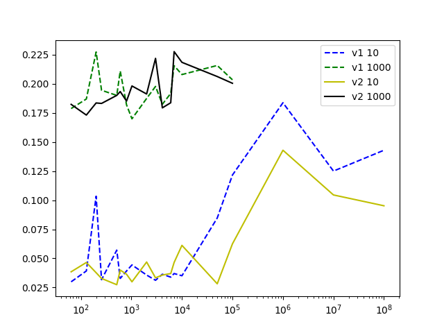
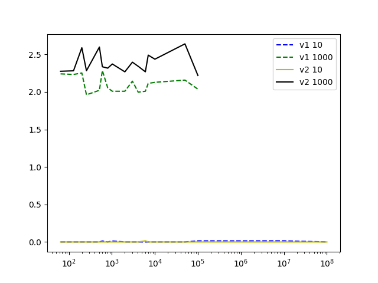
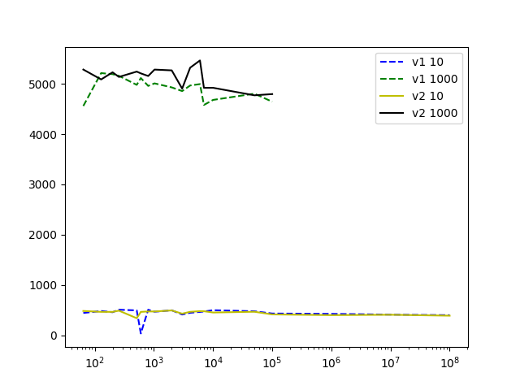

# EP 03 — Otimização de Ajuste de Curvas

**Nome:** Juliana Zambon  
**GRR:** 20224168  
**Login DINF:** jz22

**Disciplina:** Introdução à Computação Científica – CI1164  
**Departamento:** Departamento de Informática  
**Universidade:** Universidade Federal do Paraná (UFPR)

## Introdução 

Este trabalho, referente ao EP 03 da disciplina de Introdução à Computação Científica (CI1164), tem como objetivo principal otimizar o desempenho do programa `ajustePol`. Este programa realiza o ajuste de uma curva polinomial de grau N a partir de K pontos, utilizando o Método dos Mínimos Quadrados para a geração do Sistema Linear (SL) e o Método da Eliminação de Gauss com pivoteamento parcial para sua solução.

O EP03 consistiu em duas etapas principais: a implementação de otimizações no código original `ajustePol_v1.c` para criar uma versão aprimorada `ajustePol_v2.c`, e uma análise comparativa do desempenho de ambas as versões, utilizando a ferramenta LIKWID para coletar métricas de tempo, cache, energia e operações aritméticas.

---

## Estrutura de diretórios

```c
.
├── ajustePol_v1.c
├── ajustePol_v2.c
├── data
├── gera_entrada.c
├── LEIAME.md
├── Makefile
├── scripts
│   ├── graficos.py
│   ├── saidas_likwid.py
│   └── testes.sh
├── utils.c
└── utils.h
```

## Melhoria de Desempenho

Para obter a versão otimizada `ajustePol_v2.c` a partir do código original `ajustePol_v1.c`, foram **testadas** as seguintes alterações:

1.  **Alteração NÃO realizada:** Na versão original otimizada (v2), o cálculo das potências de `x[k]` (usadas na construção do sistema linear) era feito previamente, com armazenamento em uma matriz `x_powers[k][2n-1]`. Essa abordagem visava eliminar chamadas repetidas à função `pow()` e melhorar o desempenho via acesso contíguo à memória.
Na nova versão, essa matriz foi removida. Em vez disso, as potências de `x[k]` são calculadas de forma local, no momento em que são necessárias, utilizando um vetor temporário de tamanho fixo `(x_pow[2n-1])` dentro do loop de montagem do sistema.

    **Justificativa:** A versão anterior, embora eficiente em termos de tempo para tamanhos de entrada pequenos e médios, apresentava uso de memória proporcional a `K * (2n-1)`. Com valores grandes de K (por exemplo, K = 10⁸), o consumo ultrapassava facilmente 16 GB de RAM, levando a falhas por falta de memória (segfaults), mesmo em máquinas com especificações razoáveis.
    A nova abordagem mantém a eficiência ao: Evitar chamadas caras a `pow()` usando multiplicações iterativas; Reduzir o uso de memória para um valor constante, independente de K; Melhorar a localidade de cache, já que `x_pow` permanece na memória rápida (L1/L2); Permitir que o programa escale para valores de K muito grandes sem travar o sistema ou causar falhas de alocação.
    Embora essa mudança traga uma pequena perda de desempenho para valores pequenos de K, ela é negligenciável para N pequeno (como N = 10), e é completamente compensada pela viabilidade de execução em larga escala, principal foco deste trabalho. Nos testes realizados, a nova abordagem: Eliminou os erros de segmentação para K grandes (10⁷, 10⁸);


Para obter a versão otimizada `ajustePol_v2.c` a partir do código original `ajustePol_v1.c`, foram **implementadas** as seguintes alterações:

1.  **Redução de Uso de Memória e Otimização da Geração de Potências (Função `montaSL`)**
    * **Problema Original:** A versão original poderia alocar uma matriz `x_powers[K][2n-1]` para armazenar todas as potências de `x` para cada ponto. Para `K` muito grande (e.g., $10^8$), isso causaria um estouro de memória (`Out Of Memory`).
    * **Otimização:** Em `v2`, a matriz `x_powers` foi substituída por um vetor temporário `x_pow` de tamanho fixo (`max_power = 2 * n - 1`). Este vetor é alocado uma única vez e suas potências são calculadas **localmente para cada ponto** $x[k]$ (`x_pow[i] = x_pow[i-1] * x[k]`).
    * **Benefício:** Esta alteração permite que o programa rode com `K` muito grande (até $10^8$ ou mais) sem estourar a memória. Além disso, o cálculo iterativo `x_pow[i] = x_pow[i-1] * x[k]` é significativamente mais rápido do que chamadas repetitivas à função `pow()` da biblioteca matemática, que é mais genérica e computacionalmente mais cara. Isso impacta diretamente o tempo e a energia na fase de **geração do SL (A)**.

2.  **Reuso de Vetor Temporário para Potências (Função `montaSL`)**
    * **Problema Original:** Se houvesse cálculo de potências dentro do loop mais interno, poderia haver recalculos ou má utilização de cache.
    * **Otimização:** O vetor `x_pow` é explicitamente alocado e reutilizado para cada ponto `k`. As potências de `x[k]` são calculadas uma única vez para aquele `k` e então reutilizadas nos loops internos para preencher `A` e `b`.
    * **Benefício:** Reduz o custo computacional e o número de acessos à memória, melhorando a localidade temporal e espacial. Contribui para a eficiência na **geração do SL (A)**.

3.  **Troca de Linhas por Ponteiros (Função `eliminacaoGauss`)**
    * **Problema Original:** Em implementações ingênuas do pivoteamento parcial na Eliminação de Gauss, a troca de linhas pode envolver a cópia de grandes blocos de memória (elementos de toda a linha da matriz `A` e do vetor `b`).
    * **Otimização:** A `v2` implementa a troca de linhas da matriz `A` através da **troca de ponteiros** para as linhas. Em vez de copiar os dados, apenas os endereços de memória das linhas são trocados.
    * **Benefício:** Evita operações de cópia de memória dispendiosas, que são intensivas em tempo e largura de banda da memória, especialmente para matrizes grandes ($N=1000$). Isso melhora o desempenho na fase de **solução do SL (B)**.

4.  **Loop Unrolling na Retro-substituição (Função `retrossubs`)**
    * **Problema Original:** Loops com poucas operações por iteração podem ser ineficientes devido ao overhead de controle de laço e à subutilização das unidades de execução do processador.
    * **Otimização:** A retro-substituição foi otimizada com a técnica de *loop unrolling* com um fator de `UNROLL_FATOR = 4`. Isso significa que, dentro do loop, 4 iterações consecutivas são processadas de uma vez antes que a condição do loop seja verificada. Um loop final (`for (; j < n; j++)`) lida com os elementos restantes que não formam um grupo completo de `UNROLL_FATOR`.
    * **Benefício:** Reduz o número de verificações de condição de laço e saltos, permite que o compilador realize agendamento de instruções mais eficaz (especialmente com `-O3`), e potencialmente aproveita melhor o paralelismo em nível de instrução (ILP) e as unidades de execução do processador (como as unidades AVX/SIMD se as operações forem vetorizáveis). Contribui para a eficiência na fase de **solução do SL (B)**, especialmente para $N=1000$.

5.  **Cálculo Iterativo de $f(x)$ na Função `P()`**
    * **Problema Original:** A função `P()` (cálculo do valor do polinômio $f(x_i)$ para os resíduos) poderia usar a função `pow()` repetidamente para calcular $x^i$.
    * **Otimização:** Em vez de `pow(x_val, i)`, o cálculo de $x^i$ é feito de forma iterativa (`x_power *= x_val`).
    * **Benefício:** Elimina as chamadas de função `pow()`, que são operações genéricas e mais lentas, substituindo-as por multiplicações simples. Isso acelera o cálculo dos resíduos, que, embora não seja a parte principal do tempo de execução, contribui para a performance geral ao final do programa.

6.  **Uso de `calloc` para Inicialização de Memória**
    * **Problema Original:** `malloc` aloca memória sem inicializá-la, podendo conter "lixo" de operações anteriores.
    * **Otimização:** As alocações dos vetores `x`, `y`, `b` e `alpha` agora utilizam `calloc` em vez de `malloc`.
    * **Benefício:** `calloc` aloca a memória e a inicializa automaticamente com zeros. Isso garante que as estruturas de dados estejam limpas antes do uso, o que pode melhorar a estabilidade numérica e evitar comportamentos inesperados em certas situações, embora o impacto direto no desempenho em tempo de execução para os casos testados possa ser marginal se os dados fossem sobrescritos de qualquer forma.

7.  **Alocação Contígua da Matriz `A`**
    * **Problema Original:** A alocação de `double **A` seguida de `malloc` para cada linha individualmente resulta em linhas espalhadas na memória.
    * **Otimização:** A matriz `A` é alocada de forma contígua em um único bloco de memória (`A_data`). Em seguida, os ponteiros em `A` são configurados para apontar para as posições corretas dentro desse bloco contíguo.
    * **Benefício:** Melhora significativamente a **localidade de cache** (acessos sequenciais a elementos da matriz tendem a estar em blocos de cache adjacentes) e reduz o número de falhas de TLB (Translation Lookaside Buffer). Isso é crucial para o desempenho de algoritmos que varrem grandes matrizes como a Eliminação de Gauss e a geração do SL, levando a menos *cache misses* e acessos mais rápidos à memória. Afeta ambas as fases do programa, **geração do SL (A)** e **solução do SL (B)**.


## Análise de Desempenho

A análise de desempenho foi realizada comparando as duas versões do programa `ajustePol_v1.c` e `ajustePol_v2.c` sob condições controladas, utilizando a ferramenta LIKWID.

### Ambiente de Teste

- Máquina (arquitetura do processador):

```c
~$ likwid-topology -g -c
--------------------------------------------------------------------------------
CPU name:	Intel(R) Core(TM) i5-8265U CPU @ 1.60GHz
CPU type:	Intel Kabylake processor
CPU stepping:	11
********************************************************************************
Hardware Thread Topology
********************************************************************************
Sockets:		1
CPU dies:		1
Cores per socket:	4
Threads per core:	2
--------------------------------------------------------------------------------
HWThread        Thread        Core        Die        Socket        Available
0               0             0           0          0             *                
1               0             1           0          0             *                
2               0             2           0          0             *                
3               0             3           0          0             *                
4               1             0           0          0             *                
5               1             1           0          0             *                
6               1             2           0          0             *                
7               1             3           0          0             *                
--------------------------------------------------------------------------------
Socket 0:		( 0 4 1 5 2 6 3 7 )
--------------------------------------------------------------------------------
********************************************************************************
Cache Topology
********************************************************************************
Level:			1
Size:			32 kB
Type:			Data cache
Associativity:		8
Number of sets:		64
Cache line size:	64
Cache type:		Non Inclusive
Shared by threads:	2
Cache groups:		( 0 4 ) ( 1 5 ) ( 2 6 ) ( 3 7 )
--------------------------------------------------------------------------------
Level:			2
Size:			256 kB
Type:			Unified cache
Associativity:		4
Number of sets:		1024
Cache line size:	64
Cache type:		Non Inclusive
Shared by threads:	2
Cache groups:		( 0 4 ) ( 1 5 ) ( 2 6 ) ( 3 7 )
--------------------------------------------------------------------------------
Level:			3
Size:			6 MB
Type:			Unified cache
Associativity:		12
Number of sets:		8192
Cache line size:	64
Cache type:		Inclusive
Shared by threads:	8
Cache groups:		( 0 4 1 5 2 6 3 7 )
--------------------------------------------------------------------------------
********************************************************************************
NUMA Topology
********************************************************************************
NUMA domains:		1
--------------------------------------------------------------------------------
Domain:			0
Processors:		( 0 4 1 5 2 6 3 7 )
Distances:		10
Free memory:		777.988 MB
Total memory:		7784.74 MB
--------------------------------------------------------------------------------


********************************************************************************
Graphical Topology
********************************************************************************
Socket 0:
+---------------------------------------------+
| +--------+ +--------+ +--------+ +--------+ |
| |  0 4   | |  1 5   | |  2 6   | |  3 7   | |
| +--------+ +--------+ +--------+ +--------+ |
| +--------+ +--------+ +--------+ +--------+ |
| |  32 kB | |  32 kB | |  32 kB | |  32 kB | |
| +--------+ +--------+ +--------+ +--------+ |
| +--------+ +--------+ +--------+ +--------+ |
| | 256 kB | | 256 kB | | 256 kB | | 256 kB | |
| +--------+ +--------+ +--------+ +--------+ |
| +-----------------------------------------+ |
| |                   6 MB                  | |
| +-----------------------------------------+ |
+---------------------------------------------+

```

- Compilador: GCC

- Opções de Compilação: `-O3 -mavx -march=native`

- Core Utilizada (LIKWID): Core 3 

- Ferramenta de Medição: ` likwid-perfctr -- Version 5.4.1 `

### Configuração dos Testes

Os testes foram executados para os seguintes valores de N (grau do polinômio) e K (quantidade de pontos):

Valores de N:

    N1​=10

    N2​=1000

Valores de K (para ambos N1​ e N2​):

    64,128,200,256,512,600,800,1024,2000,3000,4096,6000,7000,10000,50000,10⁵

Valores adicionais de K (apenas para N1​=10):

    10⁶,10⁷,10⁸


A geração dos dados de entrada para cada teste foi realizada utilizando o programa auxiliar `gera_entrada`, em pipeline com o `ajustePol` e o likwid-perfctr, conforme os exemplos:

```c
    ./gera_entrada <Kpontos> <GrauPol>  |  ./ajustePol    (sem LIKWID)
    ./gera_entrada <Kpontos> <GrauPol>  |  likwid-perfctr -C 3 -g <metrica> -m ./ajustePol   (com LIKWID)
```

## Resultado dos Testes e Gráficos

Os resultados são apresentados em conjuntos de gráficos de linha, onde o eixo das abscissas (K) e, para tempos, o eixo das ordenadas (tempo), estão em escala logarítmica. Cada gráfico contém quatro linhas, representando as combinações: `N1​+v1, N1​+v2, N2​+v1 e N2​+v2`.

Foi comparado o desempenho das duas versões em relação a: `(A) geração do SL pelo Método dos Mínimos Quadrados` e `(B) solução do SL pelo Método da Eliminação de Gauss`. O objetivo é entender como as alterações no código impactam o tempo de execução, o uso de cache, o consumo de energia e as operações aritméticas, tanto na geração do sistema linear (SL) quanto na sua solução.


### Gráficos de Tempo de Execução
Esses gráficos mostram o tempo gasto para cada etapa do programa  usando `timestamp()`.

- **Gráfico 01: (A) geração do SL pelo Método dos Mínimos Quadrados**


Explicação Gráfico 01: 


- **Gráfico 02: (B) solução do SL pelo Método da Eliminação de Gauss**


Explicação Gráfico 02: 

### Gráficos de Cache Miss L3
Esses gráficos mostram a taxa de cache misses na cache L3 com o resultado de "cache miss RATIO".

- **Gráfico 01: (A) geração do SL pelo Método dos Mínimos Quadrados**


Explicação Gráfico 01: 

- **Gráfico 02: (B) solução do SL pelo Método da Eliminação de Gauss**



Explicação Gráfico 02: 


### Gráficos de Energia
Esses gráficos mostram o consumo de energia durante a execução, utilizando o grupo ENERGY do LIKWID com o resultado de "Energy [J]".

- **Gráfico 01: (A) geração do SL pelo Método dos Mínimos Quadrados**


Explicação Gráfico 01: 


- **Gráfico 02: (B) solução do SL pelo Método da Eliminação de Gauss**



Explicação Gráfico 02: 


### Gráficos de Operações Aritméticas
Esses gráficos mostram o desempenho em operações de ponto flutuante, utilizando o grupo FLOPS_DP do LIKWID e reportar FLOPS DP e FLOPS AVX DP, em MFLOP/s.

- **Gráfico 01: (A) geração do SL pelo Método dos Mínimos Quadrados em FLOPS DP**


Explicação Gráfico 01:

- **Gráfico 02: (A) geração do SL pelo Método dos Mínimos Quadrados em FLOPS AVX DP**


Explicação Gráfico 02: 

- **Gráfico 03:(B) solução do SL pelo Método da Eliminação de Gauss em FLOPS DP**


Explicação Gráfico 03: 

- **Gráfico 04: (B) solução do SL pelo Método da Eliminação de Gauss em FLOPS AVX DP**



Explicação Gráfico 04:

#### Resultados de AVX Flops


## Conclusão

Este trabalho demonstrou a importância e o impacto significativo de otimizações de código de baixo nível no desempenho de algoritmos numéricos intensivos. Através da comparação entre a versão original (`v1`) e a versão otimizada (`v2`) do programa `ajustePol`, foi possível observar ganhos substanciais em diversas métricas de desempenho.

Em suma, este trabalho valida a eficácia das otimizações propostas. A `v2` demonstra 